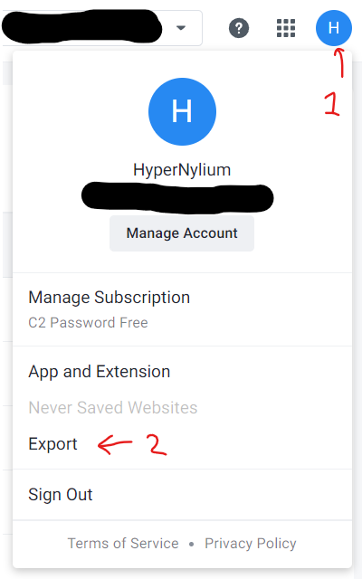
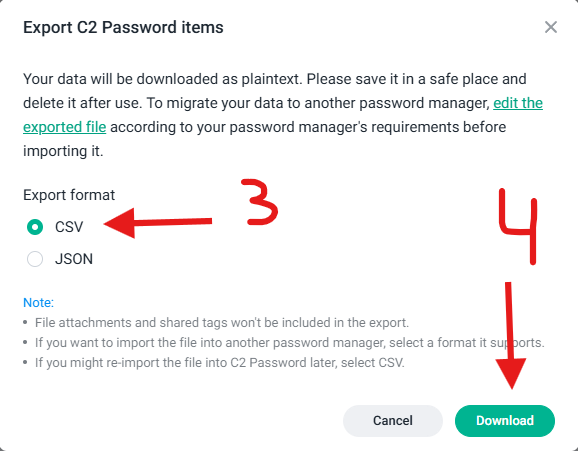
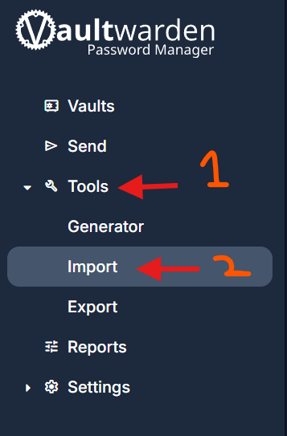
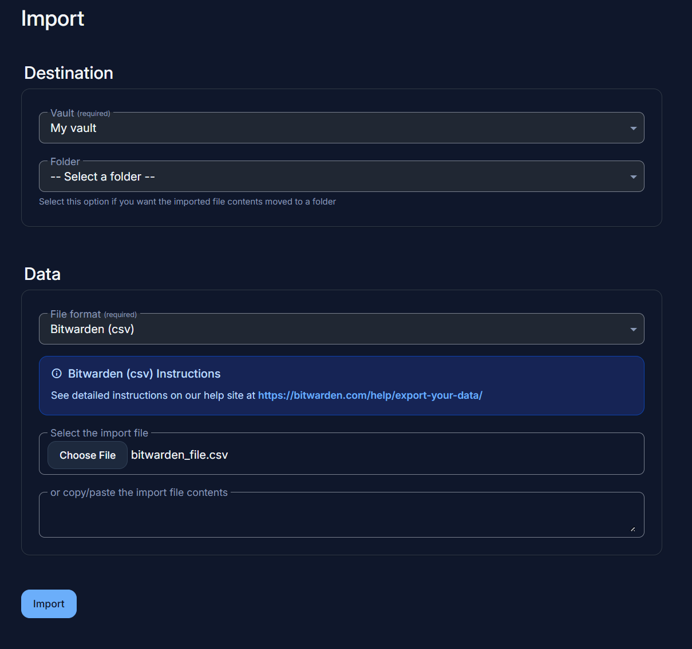

# SynologyC2Password to Bitwarden formatter/translater

## Description
Converts a Synology C2 Password export (`.csv`) into a Bitwarden/Vaultwarden importable `.csv`.

## Getting Started
First, let's export those juicy passwords from Synology C2 Password:
1. Open the Synology C2 Passwords web interface.
2. Click your profile icon (top right), then `Export`, then `Download`.
3. Save the file to your computer.




Now follow the steps for your OS.

### Windows
1. Download the latest `syno2bw.exe` from the [releases page](https://github.com/HyperNylium/SynologyC2Password-to-Bitwarden/releases).
    - Windows Defender SmartScreen may warn you because I'm not a verified publisher. Click `More info` then `Run anyway`.
2. Put `syno2bw.exe` in the **same folder** as your exported Synology C2 `.csv` file.
3. **Double-click `syno2bw.exe`.** That's it.
    - It finds your export, asks you to confirm, converts it, and saves `bitwarden_file.csv` in the same folder.
    - The window stays open so you can read the results (and any skipped entries). Press Enter to close it.

**Tip:** You can also drag your exported `.csv` straight onto `syno2bw.exe` to convert it.

<details>
<summary>Advanced: run from a terminal</summary>

In File Explorer, type `cmd` in the folder's address bar and press Enter, then run `syno2bw.exe`.  
You can also pass the export directly: `syno2bw.exe "C:\path\to\C2Password_Export.csv"`.
</details>

### Linux/Source
1. Install Python 3.13 (3.11, 3.12, 3.13 and 3.14 works too):
   ```bash
   sudo apt update && sudo apt install software-properties-common
   sudo add-apt-repository ppa:deadsnakes/ppa
   sudo apt update
   sudo apt install python3.13
   ```
2. Clone and enter the repo:
   ```bash
   git clone https://github.com/HyperNylium/SynologyC2Password-to-Bitwarden.git
   cd SynologyC2Password-to-Bitwarden
   ```
3. Put your C2 export `.csv` in the same folder, then run `python3.13 syno2bw.py` and follow the prompts.

Notes:
- The script writes `bitwarden_file.csv` next to your export, so make sure you have write permission in that folder.
- Tested on Python 3.11 and 3.13, but it should work on 3.11+. If you hit an issue, please open one :)

## Import to Bitwarden/Vaultwarden
1. Open your Bitwarden/Vaultwarden web interface.
2. Click the `Tools` on the left side, then `Import`.



3. Under the "Destination" section, you can choose what vault or folder to import into.
4. Under the "Data" section, make sure the "File format" dropdown is set to `Bitwarden (csv)`.  
    This is important for the import to work correctly.
5. Click `Choose file`, pick the `bitwarden_file.csv` the script made, then click `Import data`. Done!



## How it all started
I wanted to move my passwords from Synology C2 Password to a Vaultwarden instance I set up in Docker. I found [this reddit post](https://www.reddit.com/r/synology/comments/1d21avn/export_c2_password_data/) in the same situation. I only had logins, no cards or notes. Using [this Bitwarden help article](https://bitwarden.com/help/condition-bitwarden-import/) (see the ".csv for individual vault" part), I mapped the C2 fields to the Bitwarden ones.

### Field mapping (Syno C2 -> Bitwarden)
| Bitwarden field | From Synology C2 |
|---|---|
| `folder` | left empty, assign during import |
| `favorite` | `Favorite` (empty if missing) |
| `type` | always `login` (the C2 export doesn't say the type) |
| `name` | `Display_Name` |
| `notes` | `Notes` |
| `fields` | left empty, add custom fields by hand after import |
| `reprompt` | `0` ("Master password re-prompt" off, not in C2. `0 = off`, `1 = on`) |
| `login_uri` | `Login_URLs` (joined together) |
| `login_username` | `Login_Username` |
| `login_password` | `Login_Password` |
| `login_totp` | `Login_TOTP` |

### Limitations
- Only converts Synology C2 Password (`.csv`) to Bitwarden (`.csv`). No bitwarden `.json` format.
- Every entry becomes a `login`. Other categories (Payment Card, Identity, Bank Account, etc) are not transferred.  
    The script lists anything it skips so nothing disappears silently.
- Custom fields are not mapped. Add them manually after importing.
- "Match detection" is not transferred.

### Good to know
- Tested importing into Vaultwarden with the `Bitwarden (.csv)` format, on Python 3.11.5/3.13.11 (Windows 11) and 3.11.9 (Ubuntu 24.04).
- **DO NOT DELETE ANYTHING** from Synology C2 Password until you are 100% sure everything imported correctly.
- I'll look into supporting "Payment card" and "Secure note"in the future.

Feedback and suggestions are welcome! I'm not a professional programmer, so please be gentle. I'm learning as I go.

I hope this helps someone out there :)